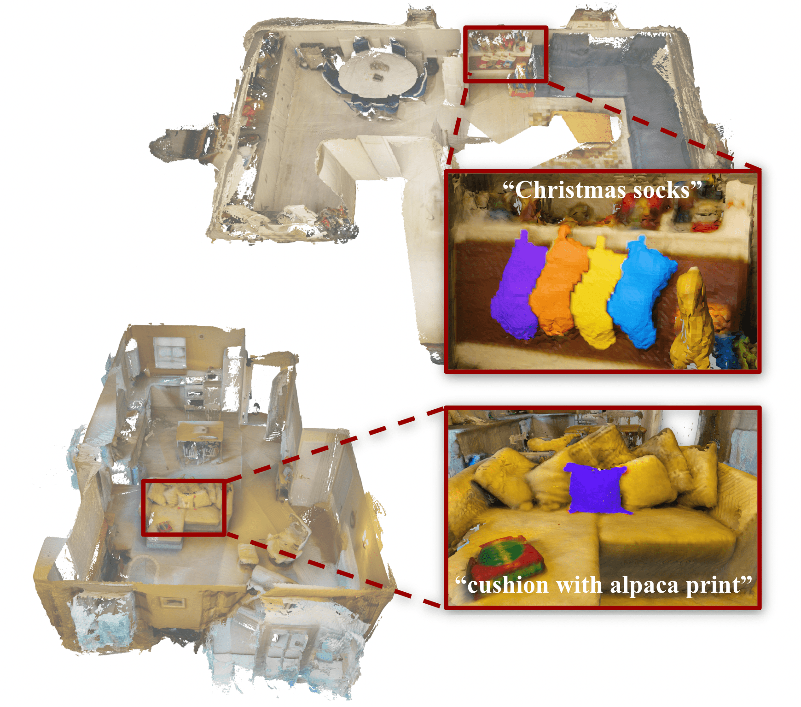

# 2nd Workshop on Open-Vocabulary 3D Scene Understanding 

<h2><strong>Challenge Track 1</strong>: Open-vocabulary 3D object instance search</h2>

<!--  -->
<!-- <video controls autoplay loop poster="assets/teaser2_poster.png">
  <source src="assets/teaser2.mp4" type="video/mp4">
</video> -->

<!--  -->
<p align="center">

</p>


## Overview 

<div style="text-align: justify">
The ability to perceive, understand and interact with arbitrary 3D environments is a long-standing research goal with applications in AR/VR, robotics, health and industry. Many 3D scene understanding methods are largely limited to recognizing a closed-set of pre-defined object classes. In the first track of our workshop challenge, we focus on open-vocabulary 3D object instance search. Given a 3D scene and an open-vocabulary, text-based query, the goal is to localize and densely segment all object instances that fit best with the specified query. If there are multiple objects that fit the given prompt, each of these objects should be segmented, and labeled as separate instances. The list of queries can refer to long-tail objects, or can include descriptions of object properties such as semantics, material type, and situational context.
</div>

## Tentative dates

- Submission Portal: EvalAI
- Data Instructions & Helper Scripts: April 17, 2024
- Dev Phase Start: April 17, 2024
- Submission Portal Start: April 19, 2024
- Test Phase Start: May 1, 2024
- Test Phase End: June 8, 2024 (23:59 Pacific Time)


## Task description

In the second track of our workshop challenge, we propose the following challenge:

>**TASK:** Given an open-vocabulary, text-based query, the aim is to localize and segment the object instances that fit best with the given prompt, which might describe object properties such as semantics, material type, affordances and situational context. 

>**INPUT:**  An RGB-D sequence and the 3D reconstruction of a given scene, camera parameters, and a text-based input query.

>**OUTPUT:** Instance segmentation of the point cloud that corresponds to the vertices of the provided 3D mesh reconstruction, segmenting the objects that fit best with the given prompt.

For this challenge, we use the [**ARKitScenes dataset**](https://github.com/apple/ARKitScenes). In this repository, we provide instructions for downloading the data necessary for our challenge, as well as demo/utility scripts that are meant to guide the participants about how to read and use the data. Furthermore, we provide an example evaluation script. 

This README consists of 4 sections:
1. [Data Download Instructions](#data-download-instructions)
2. [Data Organization and Format of Input Data](#data-organization-and-format-of-input-data)
3. [Submission Instructions](#submission-instructions)
4. [Evaluation Guidelines](#evaluation-guidelines)

---
## **Data download instructions**

This section will guide you about how to download the dataset, and explain the downloaded files relevant for our challenge. In our challenge, we use ARKitScenes, particularly the `raw` dataset.

>**Important Note:** By following the instructions to download the dataset, you agree with the [license & terms and conditions of the ARKitScenes dataset](https://github.com/apple/ARKitScenes/blob/main/LICENSE), as well as the [code of conduct](https://github.com/apple/ARKitScenes/blob/main/CODE_OF_CONDUCT.md) provided in the original ARKitScenes repository. 


### **Challenge Phases**
Our challenge consists of two phases: *Development Phase*, and *Test Phase*.

- In the first phase, the *Development Phase*, the challenge participants can download and use the whole *Training* split of the ARKitScenes dataset for their experiments. From these *Training* scenes, we annotate a few example scenes for development purposes. More specifically, for each example scene, we first specify an open-vocabulary query, and then manually annotate objects corresponding to the given query, by segmenting them in the point cloud of the given scene. We refer to this subset as the *Challenge Development* set. The participants can upload their predictions on scenes from the *Challenge Development* set to the [Phase 1 - Development Benchmark](https://eval.ai/web/challenges/challenge-page/2102/submission) in the challenge website.

- In the second phase, the *Test Phase*, we provide a subset of scenes from the *Validation* split of the ARKitScenes dataset, we refer to this subset as the *Challenge Test* set. For each of these scenes, we provide an input text-query. The participants are expected to upload their predictions for each scene from the *Challenge Test* to the [Phase 2 - Test Benchmark](https://eval.ai/web/challenges/challenge-page/2102/submission) in the challenge website.


### **Download Instructions**

In order to download the full training data, you can use the `download_data_opensun3d.py` script. This script takes as argument a csv file that lists the video ids to be downloaded, as well as the dataset assets that we want to download. We provide 3 different csv files at [benchmark_file_lists](https://github.com/OpenSun3D/cvpr24-challenge/challenge_track_1/benchmark_file_lists).
The ARKitScenes dataset provides many raw data assets, but we are particularly interested in the depth images, RGB images, camera intrinsics, camera trajectory (poses), and the 3D scene reconstrucion.

You can use the following script with the given arguments to download the data (Phase 1 - Challenge Development Set, Phase 2 - Challenge Test Set are mandatory. Optionally, if you need to train a model, we provide a command to download the original training set):

#### **Phase 1 - Download Challenge Development Set (~5GB)**
Download the data using
```
python3 challenge/download_data_opensun3d.py --data_type=challenge_development_set --download_dir PATH/TO/ARKITSCENES/DOWNLOAD/DIR
```
Queries for each scene are available in [`queries_development_scenes.csv`](https://github.com/OpenSun3D/cvpr24-challenge/challenge_track_1/benchmark_file_lists/queries_development_scenes.csv).

Furthermore, we provide ground truth instance masks for the development scenes [here](https://github.com/OpenSun3D/cvpr24-challenge/challenge_track_1/benchmark_data/gt_development_scenes), whose data format is explained [here](https://github.com/OpenSun3D/cvpr24-challenge/challenge_track_1/benchmark_data/gt_data_format.md). Please note that submission of the predicted masks require a different file format, explained in more detail [here](#submission-instructions).

#### **Phase 2 - Download Challenge Test Set (~30GB)**
```
python3 challenge/download_data_opensun3d.py --data_type=challenge_test_set --download_dir PATH/TO/ARKITSCENES/DOWNLOAD/DIR
```
Queries for each scene are available in [`queries_test_scenes.csv`](https://github.com/OpenSun3D/cvpr24-challenge/challenge_track_1/benchmark_file_lists/queries_test_scenes.csv).

#### *(Optional, needed only if you want to train a model) Download Full Training Set (Several hundreds of GBs)*
```
python3 challenge/download_data_opensun3d.py --data_type=full_training_set --download_dir PATH/TO/ARKITSCENES/DOWNLOAD/DIR
```

Some of these scenes do not have `wide` assets (see below). If you want to download only the training scenes that have `wide` assets, you can alternatively run the following command:

```
python3 challenge/download_data_opensun3d.py --data_type=full_training_set_w_wide_assets --download_dir PATH/TO/ARKITSCENES/DOWNLOAD/DIR
```

NOTE: If you need to download other assets from the ARKitScenes, please see the [data instructions](https://github.com/apple/ARKitScenes/blob/main/DATA.md) in the [original ARKitScenes repository](https://github.com/apple/ARKitScenes) for further details.

---
## **Data Organization and Format of Input Data**
Using the given commands to download the data for Phase 1 and 2 will save a variety of assets in the folder you specified (`PATH/TO/ARKITSCENES/DOWNLOAD/DIR`).
This data folder will include two directories, `ChallengeDevelopmentSet` and `ChallengeTestSet` which includes all assets belonging to challenge development and test data respectively.

For each `SCENE_ID`, a folder is created with the following structure:

```
PATH/TO/ARKITSCENES/DOWNLOAD/DIR/{ChallengeDevelopmentSet or ChallengeTestSet}/SCENE_ID
├── {SCENE_ID}_3dod_mesh.ply # reconstructed 3D mesh of the scene
└── lowres_wide              # RGB images of the wide camera (256x192) - 60 FPS
    ├── 6845.80601079.png    # filenames are indexed by timestamps
    ├── 6845.90596450.png
    └── ...
└── lowres_depth           # the depth image acquired by AppleDepth Lidar (256x192)
    ├── 6845.80601079.png  # filenames are indexed by timestamps
    ├── 6845.90596450.png
    └── ...
└── wide                   # the RGB images of the wide camera (1920x1440) - 10 FPS
    ├── 6845.80601079.png  # filenames are indexed by timestamps
    ├── 6845.90596450.png
    └── ...
└── lowres_wide_intrinsics # camera intrinsics for low res. camera
    ├── 6845.7061.pincam   # filenames are indexed by timestamps
    ├── 6845.8061.pincam
    └── ...
└── wide_intrinsics        # camera intrinsics for high res. camera
    ├── 6845.80601079.png  # filenames are indexed by timestamps
    ├── 6845.90596450.png
    └── ...
└── lowres_wide.traj       # camera trajectory, each line has the pose for a new timestamp
```

Data formats are described in the following:
1. `.png` - store RGB images, depth images and confidence images
    - `RGB images` - regular `uint8`, 3 channel image
    - `depth image` - `uint16` png format in millimeters
2. `.pincam` - store the intrinsic matrix for each RGB image
    - is a single-line text file, space-delimited, with the following fields: 
    `width` `height` `focal_length_x` `focal_length_y` `principal_point_x` `principal_point_y` 
3. `.traj` -  is a space-delimited file where each line represents a camera position at a particular timestamp
    - Column 1: timestamp
    - Columns 2-4: rotation (axis-angle representation in radians)
    - Columns 5-7: translation (in meters)
4. `.ply` - stores the mesh generated by ARKit


### **Loading & using data**

>IMPORTANT NOTE: We are providing helper functions and an example dataloader in [`demo_dataloader_lowres.py`](https://github.com/OpenSun3D/cvpr24-challenge/challenge_track_1/demo_dataloader_lowres.py) to load images from *low res. RGB-D sequence*, as well as the corresponding *camera intrinsics* and *poses*. If you need anything else, please refer to the helper functions in the [original ARKitScenes repository]((https://github.com/apple/ARKitScenes/)). Furthermore, additional details about what each folder refers to is provided in [this page]((https://github.com/apple/ARKitScenes/blob/main/raw/README.md)) from the original ARKitScenes repository.

You can explore the [`demo_dataloader_lowres.py`](https://github.com/OpenSun3D/cvpr24-challenge/challenge_track_1/demo_dataloader_lowres.py) file in order to better understand how to load and use the downloaded data. You can simply set the data root directory, the name of the data subset and the ID of the scene you would like to load, as follows:
```
    arkitscenes_root_dir = "PATH/TO/ARKITSCENES/DOWNLOAD/DIR
    data_type = "ChallengeDevelopmentSet" # or "ChallengeTestSet"
    scene_id = "42445173" # an example scene ID
```

Queries for each development scene are available in [`queries_development_scenes.csv`](https://github.com/OpenSun3D/cvpr24-challenge/challenge_track_1/benchmark_file_lists/queries_development_scenes.csv), and queries for each test scene are available in [`queries_test_scenes.csv`](https://github.com/OpenSun3D/cvpr24-challenge/challenge_track_1/benchmark_file_lists/queries_test_scenes.csv). First column is `video_id`, second column is `visit_id` and the last column is the open vocabulary query. What we refer to as `{SCENE_ID}` in this document is the `video_id`.

---
## **Submission Instructions**
Given the open-vocabulary query, the participants are asked to segment object instances that fit best with the query. Expected result is object instance masks, and confidence scores for each mask. 

We ask the participants to upload their results as a single `.zip` file, which when unzipped must contain in the root the prediction files. There must not be any additional files or folders in the archive except those specified below.

Results must be provided as a text file for each scene. Each text file should contain a line for each instance, containing the relative path to a binary mask of the instance, and the confidence of the prediction. The result text files must be named according to the corresponding scan, as `{SCENE_ID}.txt` with the corresponding scene ID. Predicted `.txt` files listing the instances of each scan must live in the root of the unzipped submission. Predicted instance mask files must live in a subdirectory of the unzipped submission. For instance, a submission should look like:

```
submission_opensun3d
    |__ {SCENE_ID_1}.txt
    |__ {SCENE_ID_2}.txt 
         ⋮
    |__ {SCENE_ID_N}.txt
    |__ predicted_masks/
        |__ {SCENE_ID_1}_000.txt
        |__ {SCENE_ID_1}_001.txt
            ⋮
```

Each prediction file for a scene should contain a list of instances, where an instance is: (1) the relative path to the predicted mask file, (2) the float confidence score. If your method does not produce confidence scores, you can use 1.0 as the confidence score for all masks. Each line in the prediction file should correspond to one instance, and the two values above separated by a space. Thus, the filenames in the prediction files must not contain spaces.
The predicted instance mask file should provide a mask over the vertices of the provided scene reconstruction mesh, e.g. `{SCENE_ID}_3dod_mesh.ply`, following the original order of the vertices in this file.
Each instance mask file should contain one line per point, with each line containing an integer value, with non-zero values indicating part of the instance. For example, a given `{SCENE_ID}.txt` file, e.g.,`42445173.txt`, could look like the following:

```
predicted_masks/42445173_000.txt 0.7234
predicted_masks/42445173_001.txt 0.9038
⋮
```

and `predicted_masks/42445173_000.txt` could look like:
```
0
0
1
1
⋮
0
```


---
## **Evaluation Guidelines**
In order to evaluate the results, we provide [evaluation functions](https://github.com/OpenSun3D/cvpr24-challenge/challenge_track_1/benchmark_scripts/eval_utils/eval_script_inst.py) as well as an example [evaluation script](https://github.com/OpenSun3D/cvpr24-challenge/challenge_track_1/demo_eval.py). We follow the standard evaluation for 3D instance segmentation, and compute Average Precision (AP) scores. The evaluation script computes the AP scores for each scene and then averages the scores over all scenes. 

## Contact Us

For any technical issues or questions regarding the challenge, please raise an issue on the [Github repo](https://github.com/OpenSun3D/cvpr24-challenge/issues).

For direct contact, or any concerns: [email us](mailto:ayca.takmaz@inf.ethz.ch).

<!-- * `mkdocs new [dir-name]` - Create a new project.
* `mkdocs serve` - Start the live-reloading docs server.
* `mkdocs build` - Build the documentation site.
* `mkdocs -h` - Print help message and exit. -->

<!-- ## Data download

    mkdocs.yml    # The configuration file.
    docs/
        index.md  # The documentation homepage.
        ...       # Other markdown pages, images and other files.


## Submission instructions


## Evaluation guidelines -->